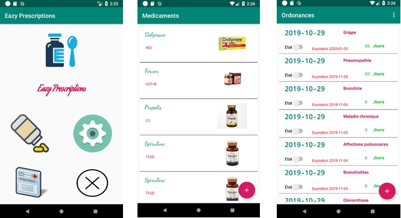

 
    
 

 
## TITLE

Development of an Eazy Prescriptions mobile app

## OBJECTIVES

This academic project consists in developing a mobile app (Eazy Prescriptions) that reminds a person of the drugs, which should be taken.

This application contains 3 modules:

- **drug:** the user can add, modify and delete a drug. The user can also add the photo of the drug using by accessing the camera.
- **Prescription:** the user can add and modify a prescription and change its status(Active/Inactive).
- **Dosage:** the user can add a described dosage when (morning, noon, evening, night), how (before, during or after the meal) and how many (the number of times) drugs are taken per day.

## TASKS

• Create graphical interfaces using fragments
• Apply the CAD pattern to the project architecture.
• Liaise between GUI and java classes
• Develop drug, dosage and prescription modules.
• Test each module

## TECHNOLOGIES
Java, Android, DAO pattern
